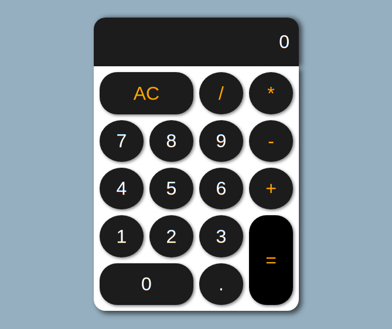
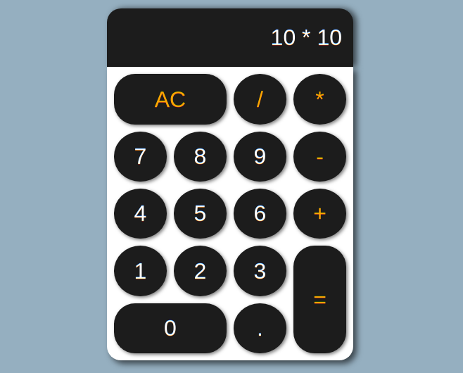

# React Calculator

## Sections
- [DEMO](#demo)
- [FEATURES](#features)
- [TECHNOLOGIES USED](#technologies-used)
- [DETAILS](#details)

## Demo
You can try the calculator yourself [here](https://vshalt.github.io/react-calculator) or https://vshalt.github.io/react-calculator

## Features
- Responsive design.
- Calculator with basic operators.
- No hard limit on the length of calculation.
- Computations are accurate to a precision of 15.

## Technologies Used
- React
- HTML
- CSS
- JavaScript

## Details
Calculator made with React. Got to learn about eval in JavaScript and how to handle multiple cases that a user can execute. There might still be some bugs :)
Enjoy!
